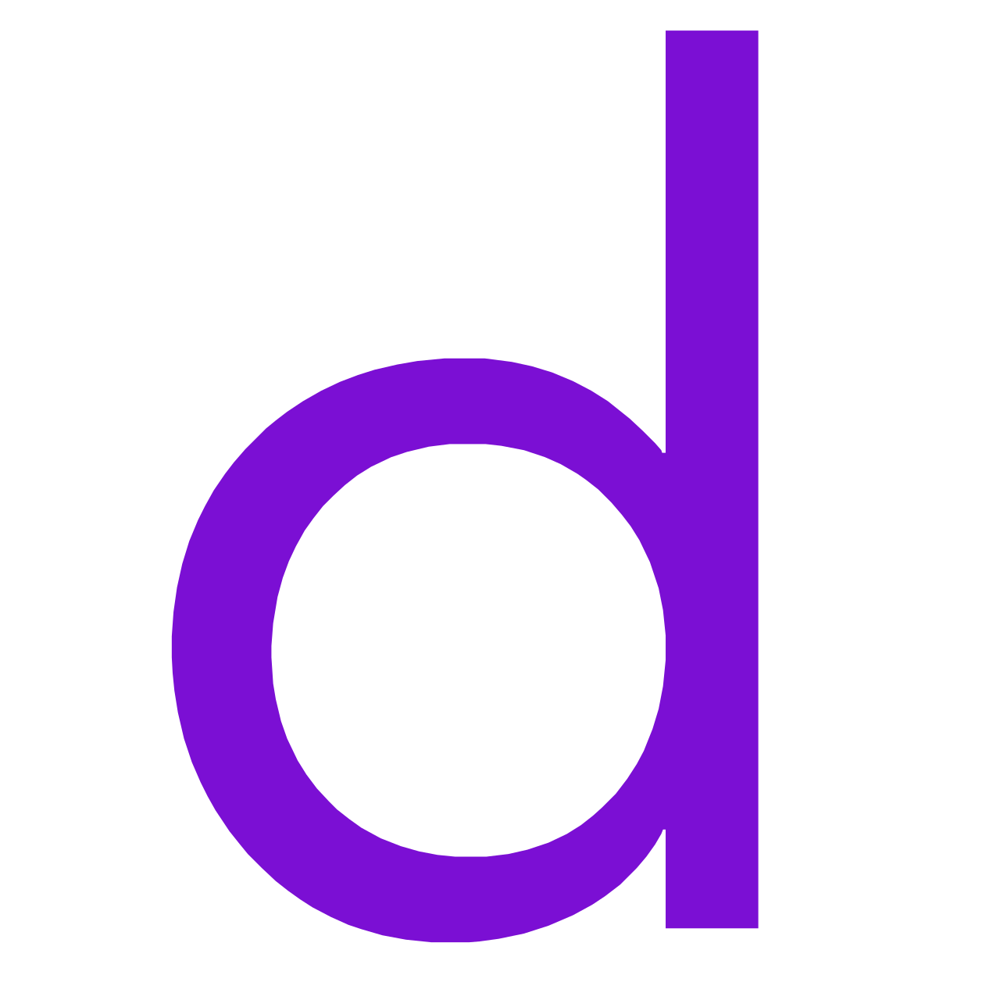

<h1 align="center">Hey there, I'm Meehad Ali  </h1>

<h2 align="center"> 📖 About me</h2>

💻 I'm a Coding Enthusiast 
🎨 I'm a self-taught Backend Developer 
🔗 I make APIs using Django 
🎓 I'm an individual who completed my BCA 
🌐 You can see some of my projects on my  Repo 
🧑‍💻 I'm currently working at  

  

<h3 align="center">⬇ Scroll down to see <a href="https://github.com/Meehad?tab=repositories">my repos</a>! ⭐ Stars are appreciated!</h3>

<h2 align="center"> 🙋‍♂️ Connect with me:</h2>
 

  
  
  

 

<h2 align="center"> 👨‍💻 Languages and Tools:</h2>
 

  
  
  
  
  
  
  
  
  

 

<h2 align="center"> 🏆 GitHub Achievements:</h2>

 

---

<h2 align="center"> 📊 GitHub Profile Stats </h2>

 

  

 
 

<h2 align="center">💻 Most used languages</h2>

 

